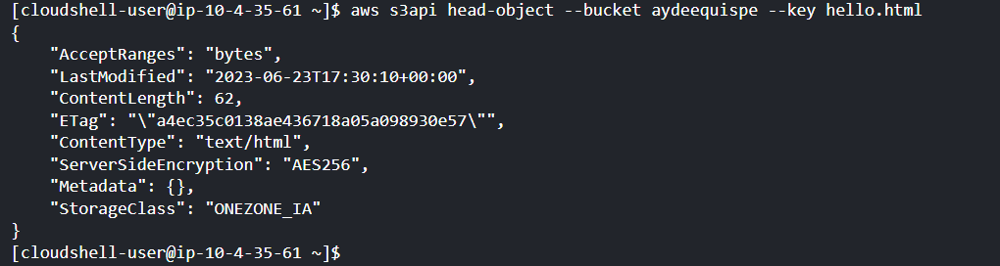

# Amazon S3 - AWS Elastic Block Store (EBS)
NOMBRE: Aydee Zenaida Quispe Rimachi
## S3
En este laboratorio, se estudiará el almacenamiento de Amazon S3. Utilizarás los comandos
aws s3 y s3api para administrar datos en Amazon S3. Amazon S3 es un almacenamiento
de objetos accesible a través de Internet.

### Parte 1: Operaciones básicas con S3

Suponga que su directorio actual es /home/aws_user (puedes cambiarlo). Envíe las siguientes instrucciones y responde las preguntas que siguen.


1. Enumere todos los buckets propiedad del usuario a través del siguiente comando ls.
   
> aws s3 ls

¿Cuál es la salida?

Aqui muestra todos los buckets, creados anteriormente.


2. Haz un bucket a través del siguiente comando mb.

> aws s3 mb s3://tu_nombre_de_usuario

¿Cuál es la salida?

El comndo mb, crea un nuevo bucket.


3. Enumera el contenido del bucket a través del siguiente comando ls.

> aws s3 ls s3://tu_nombre_de_usuario

¿Cuál es la salida?

El bucket no muestra nada por que recien se creo, dentro del bucket aun no existen objetos.

4. Crea un directorio llamado páginas web (mkdir webpages) y cd en ese directorio. Crea un archivo html simple llamado hello.html con el siguiente contenido.
```
  <html><body>
 <h1>Amazon S3</h1>
 Hello World!
 </body></html>
```
Esto muestra la creacion del directorio, con los comandos indicaciones.


Aqui se crea un archivo llamado hello.html, con el comando echo


Carga el archivo en tu bucket s3 y póngalo a disposición del público con lo siguiente.

> aws s3 cp hello.html s3://tu_nombre_de_usuario --acl public-read

¿Cuál es la salida?

5. Dado que se puede acceder a tu objeto s3 a través de Internet, probémoslo. En el navegador web de tu máquina virtual u otra9 [accede a la URL](http://s3.amazonaws.com/tu_nombre_de_usuario/hello.html). ¿Qué viste en el navegador?
Se observo el contenido del objeto html

### Parte 2: alojamiento de sitios web estáticos con S3

6. Podemos usar el bucket como almacenamiento de sitios web estáticos. Experimentamos con eso aquí. Crea dos archivos html en el directorio actual llamados index.html y error.html. El contenido de los dos archivos se muestra a continuación.

``` 
<html><body>
This is an index page!
</body></html>
<html><body>
Sorry, we can't find that page!
</body></html>
```

El comando sync compara el directorio de origen con tu bucket S3 y carga solo archivos nuevos o modificados. Entonces puedes cargar ambos archivos fácilmente a través del siguiente comando.

> aws s3 sync ./ s3://tu_nombre_de_usuario/ --acl public-read

> ¿Cuál es la salida? 

Ahora habilitamos el bucket para alojamiento de sitios web estáticos con las siguientes instrucciones.

> aws s3 website s3://tu_nombre_de_usuario/ --index-document index.html --error-document error.html

Observa cómo la instrucción enlaza ambos archivos con sus usos. En el navegador web de tu VM, [acceda a la URL](http://tu_nombre_de_usuario.s3-website-us-east-1.amazonaws.com/)

> ¿Qué viste en el navegador? 

> ¿Por qué? 

> [Ahora, acceda a](http://tu_nombre_de_usuario.s3-website-us-east-1.amazonaws.com/) hello.html

>¿Qué viste en el navegador? 

[A continuación, acceda a](http://tu_nombre_de_usuario.s3-website-us-east-1.amazonaws.com/2.html).

> ¿Qué viste en el navegador? 
 
> ¿Por qué?


7. Podemos definir reglas de redirección y agregar metadatos a los objetos en el bucket. Ejecuta el siguiente comando para hacerlo. Observa que este comando usa s3api, no s3.
   
> aws s3api put-object --bucket tu_nombre_de_usuario --key hello.html --website-redirect-location http://www.nku.edu/~haow1 --acl public-read --metadata redirection_creator=aws_user

[Ahora accede aqui](http://tu_nombre_de_usuarios3-website-us-east-1.amazonaws.com/hello.html) ¿Qué ves en el navegador?

 > ¿Por qué?

8. Para recuperar los metadatos de un objeto, usamos el subcomando head-object. Emite la siguiente instrucción.
   
> aws s3api head-object --bucket tu_nombre_de_usuario --key hello.html

¿Cuál es la salida?

Esto nos muestra de maner detallada la informacion especifica sobre el objeto hello.html

### Parte 3: Limpieza

9. Podemos eliminar objetos usando rm. Elimina tu página de índice de la siguiente manera.
   
> aws s3 rm s3://tu_nombre_de_usuario/index.html

¿Cuál es la salida?

En este caso com el comando rm, podemos eliminar cualquier archivo creado en bucket, pero en este caso debemos especificar el nombre del archivo para eliminar.


10. Y podemos quitar el bucket como un todo. Usa lo siguiente.
    
> aws s3 rb s3://tu_nombre_de_usuario --force

 ¿Cuál es la salida?

En este se elimina un bucket de S3 y el contenido, por tanto sera imposible de recuperar ambos.


> ¿Qué hace --force?
> 
> El parámetro --force utilizado en el comando aws s3 rb indica a 
la CLI de AWS que ejecute la eliminación del bucket sin solicitar confirmación adicional al usuario. Asimismo es necesario
tener en cuenta que al utilizar este parámetro, no se solicitará una confirmación adicional, lo que significa que la eliminación del bucket y sus objetos será irreversible y no se podrán recuperar.
En consecuencia, se debe tener precaución al usar este parámetro y asegurarse de que realmente se desea eliminar el bucket y
 sus datos de forma permanente.
## EBS

En este laboratorio, se utilizará la CLI de AWS para crear un volumen y una instantánea de Amazon EBS y configurar tu almacenamiento de EBS como un arreglo RAID.

### Parte 1. Crea un nuevo volumen de EBS

1. Inicia sesión en el sandbox del curso. Crea un nuevo volumen de EBS con el siguiente comando.
   
> aws ec2 create-volume --size 1 --region us-east-1 --availability-zone us-east-1c
>
> ¿Qué significa este comando? 

> ¿Cuál es la salida?


2. Utiliza el siguiente comando para ver la información de tu volumen de EBS donde se te proporcionó volume_id en el resultado del comando anterior.
   
> aws ec2 describe-volume-status --volume-ids volume_id
> 
> ¿Cuál es la salida?


3. Para crear una instancia de EBS, hazlo siguiente.
   
> aws ec2 run-instances --image-id ami-d9a98cb0 --count 1 --instance-type t1.micro --key-name tu_nombre_de_usuario-key --security-groups tu_nombre_de_usuario --placement AvailabilityZone=us-east-1c


Ahora, adjunta el volumen de EBS a la instancia. Esto lo colocas en el directorio /dev/sdf en tu instancia EC2.

> aws ec2 attach-volume --volume-id volume_id --instance-id
id_instance --device /dev/sdf

¿Cuál es la salida?
Este comando aws ec2 attach-volume se utiliza para adjuntar un volumen EBS a una instancia 
EC2 en AWS,Ademas especificando el ID del volumen, el ID de la instancia y la ruta del dispositivo donde se montará el volumen en la instancia.


1. Inicia sesión en la instancia EC2 a través de ssh. En tu instancia EC2, cambie a root. Ahora queremos crear un sistema de archivos en el volumen de EBS (el volumen de EBS es básicamente un dispositivo de almacenamiento en blanco). Luego necesitamos montar el volumen para que sea accesible. Utiliza los siguientes comandos desde tu EC2. Ten en cuenta que, según el controlador del dispositivo de bloque del kernel, el dispositivo puede estar conectado con un nombre diferente al que ha especificado. Por ejemplo, si especificas un nombre de dispositivo de
/dev/sdf, el kernel podría cambiar el nombre de tu dispositivo a /dev/xvdf, en la mayoría de los casos, la letra final sigue siendo la misma. Ejecuta lsblk en tu terminal para ver tus dispositivos de disco disponibles y tus puntos de montaje (si corresponde) para ayudarte a determinar el nombre de dispositivo correcto que debe usar. Suponga que el kernel cambia el nombre del dispositivo a /dev/xvdf.

> mkfs -F /dev/xvdf
> 
> ¿Cuál es la salida?


> mkdir /data
> 
> mount /dev/xvdf /data
> 
> cd /data/
> 
> df

> ¿Cuál es la salida?

### Parte 2. Instantáneas de EBS

5. Crea un archivo llamado aws_user.txt y escribe lo que desees en el archivo. Ahora, veremos cómo crear una copia de seguridad de todo tu volumen de EBS. El primer paso es asegurarte de que todos los datos en memoria se hayan escrito en el volumen (disco), ya que es posible que el archivo creado aún no se haya guardado en el disco. Para forzar que esto suceda, usamos el comando sync (sincronización). En la ventana de tu terminal para su instancia EC2, ejecuta las siguientes instrucciones.
   
> root@ip-10-45-185-154:/data# sync

Abre una segunda ventana de terminal en tu máquina virtual. Emite el siguiente comando.

> aws ec2 create-snapshot --volume-id volume_id
--description "Esta es mi instantánea de volumen".

donde volume_id es el id obtenido del paso 1. ¿Cuál es el resultado? Puedes verificar el estado de tu instantánea usando las siguientes instrucciones.

> aws ec2 describe-snapshots --snapshot-id snapshot_id

El snapshot_id debe ser parte de la salida de la instrucción de creación de instantáneas que acaba de ejecutar. ¿Cuál es el resultado del comando describe-snapshot? Continúa repitiendo este comando hasta que vea que el estado de la instantánea cambia a "completado", lo que significa que se ha realizado una copia de seguridad del volumen.
6. Dada una instantánea, podemos usarla para crear un nuevo volumen. Ejecuta el siguiente comando. Utiliza el ID de instantánea del paso 5.
   
> aws ec2 create-volume --region us-east-1 --availability-zone us-east-1c --snapshot-id snapshot_id

> ¿Cuál es la salida? Comprueba el estado del volumen.

>  ¿Qué comando ejecutaste para verificar el estado? 

> ¿Cuál es la salida?

7. Repite el comando de adjuntar volumen del paso 3 para adjuntar este nuevo volumen. El ID de volumen será el que se devolvió al obtener el estado 6, mientras que el ID de instancia es el de tu instancia EC2 que obtuvo en el paso 3.
   
> aws ec2 attach-volumen --volume-id volume_id --instance-id instance_id --device /dev/sdg

> ¿Cuál es la salida?

8. Vuelve a la ventana de la terminal en la que se tiene ssh en tu instancia EC2. Desde ese terminal, crea un punto de montaje llamado /data2 y monte el nuevo volumen allí. ¿Qué comandos se ejecutó para lograr ambas tareas? Cambia el directorio de su instancia EC2 a /data2.
   
> ¿Viste el archivo aws_user.txt?

9. Ahora queremos desmontar nuestros volúmenes, para lo cual usamos el comando umount. Luego separaremos los volúmenes de la instancia EC2 y los destruiremos. Los siguientes son los comandos a ejecutar. Ten en cuenta que los primeros tres comandos están en su instancia EC2 y el resto está en tu VM.
    
> root@ip-10-45-185-154:/data3# cd /
>
> root@ip-10-45-185-154:/# unmount /dev/xvdf
> 
> root@ip-10-45-185-154:/# unmount /dev/xvdg

Ahora desconecta y elimina el primer volumen, cuyo volume_id obtuvo en el paso 1. Espera unos 10 segundos después de desconectar antes de intentar eliminar.

> aws ec2 detach-volume --volume-id volume_id
> 
> aws ec2 delete-volume --volume-id volume_id

> ¿Cuáles son las salidas? 

Repite estos dos comandos para el segundo volumen,cuyo volume_id deberías haber obtenido del paso 6. 

> ¿Qué comandos usastes?

> ¿Cuáles son las salidas?

10. Elimina la instantánea con lo siguiente usando su snapshot_id del paso 5.
> aws ec2 delete-snapshot --snapshot-id snapshot_id.}

11. Cambie a la terminal. De lo que aprendiste en la parte 1, crea dos volúmenes de 1GB en la zona de disponibilidad us-east-1c.

> ¿Qué comandos ejecutaste? 

> ¿Cuáles son las salidas? 

Adjunta ambos volúmenes a tu instancia EC2, haciendo que aparezcan como /dev/sdh1 y /dev/sdh2, respectivamente.

> ¿Qué comandos ejecutaste? 

> ¿Cuáles son las salidas?

12. Cambia al terminal de la instancia EC2. Usaremos el programa mdadm de Linux para configurar los volúmenes en una configuración RAID. Instala mdadm de la siguiente manera.

> apt-get update
> 
> apt-get install mdadm

Escribe "y" y presiona enter cuando se te solicite, seleccione "No configuration" cuando se te solicite y presiona enter. Ahora ejecutamos mdadm para crear un arreglo RAID 0 en los dos volúmenes. Ejecuta lo siguiente. Donde vea "renamed_/dev/sdh1" y "renamed_/dev/shd2", usa los nombres que se te proporcionó AWS en el paso 11.

> mdadm --create /dev/md0 --level 0 --metadata=1.1 --raid-devices 2 renamed_/dev/sdh1 renamed_/dev/sdh2

> ¿Cuál es la salida?

13. Ahora, podemos comprobar el estado de la matriz RAID 0. Emite lo siguiente.
    
> mdadm --detail /dev/md0

> ¿Cuál es la salida? 

> Tenemos que agregar un sistema de archivos al arreglo RAID 0.
Entonces queremos montarlo. Haz lo siguiente.

> mkfs /dev/md0

> mkdir /data3
> 
> mount /dev/md0 /data3

El comando df de Linux muestra información sobre los sistemas de archivos montados. 

> ¿Cuál es la salida?

14. Finalizamos este laboratorio deteniendo el arreglo RAID 0, separando y eliminando ambos volúmenes de EBS y luego finalizando la instancia EC2. Para detener el arreglo RAID 0, haz lo siguiente desde su instancia EC2.
    
> cd /
> 
> unmount /dev/md0
> 
> mdadm --stop /dev/md0

Ahora, cambia a tu terminal. Separa y elimina ambos volúmenes de EBS.

 ¿Qué comandos ejecutaste? 

 ¿Cuáles son las salidas?

Finaliza tu instancia EC2.

¿Qué comando ejecutaste?

¿Cuál es la salida?


